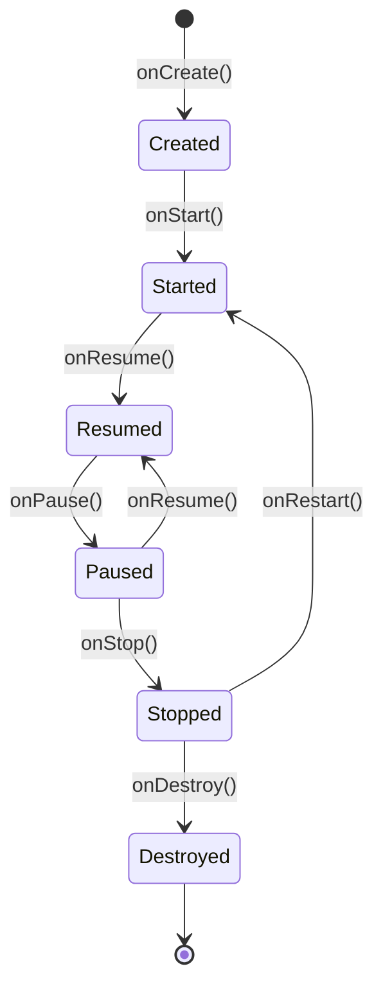

# 📱 Activity and Its Lifecycle

---

## 🔹 What is an `Activity`?

An **`Activity`** is one of the fundamental components of an Android app. It represents a **single user interface screen**—everything the user sees and interacts with at a given moment. For example, a login screen, contact list, or product details are separate activities.

Every app must have at least one activity, usually the main screen (`MainActivity`). The activity manages the screen lifecycle, responds to user actions, handles system events (e.g., screen rotation, returning to the app), and is responsible for displaying and updating the UI.

In traditional Android, an activity is defined as a class inheriting from `Activity` or `AppCompatActivity`. In modern Jetpack Compose, the activity often just **hosts a composable** in `setContent`, e.g.:

```kotlin
class MainActivity : ComponentActivity() {
    override fun onCreate(savedInstanceState: Bundle?) {
        super.onCreate(savedInstanceState)
        setContent {
            MyApp()
        }
    }
}
```

---

## 🔄 Activity Lifecycle

Activities in Android follow a lifecycle managed by the operating system. The lifecycle consists of a **series of methods automatically called** by the system depending on user interaction, device state, or resources.

---

## 🧭 Lifecycle Diagram



---

## 🧩 Lifecycle Method Descriptions

| Method         | Description |
|----------------|------------|
| `onCreate()`   | Called when the activity is first created. Initialize the UI, set up views, read data from `savedInstanceState`, register listeners, initialize ViewModel, open database connections, etc. |
| `onStart()`    | Activity becomes visible to the user but is not yet in the foreground. Start animations or prepare resources needed when the activity is visible. |
| `onResume()`   | Activity gains focus and becomes active (ready for interaction). Resume paused operations, e.g., video playback, start sensors, resume animations. |
| `onPause()`    | Activity loses focus, e.g., when another activity or dialog opens. Save temporary data, stop animations, pause media playback, unregister receivers, stop sensors. |
| `onStop()`     | Activity is no longer visible. Release resources, save data to persistent storage, close database connections, stop heavy operations. |
| `onRestart()`  | Called when the activity returns to the foreground after being stopped (`onStop`). Reinitialize resources released in `onStop()`. |
| `onDestroy()`  | Activity is being destroyed—e.g., after closing or configuration change. Release all resources, unregister listeners, close connections, stop threads. |

---

### Examples of Lifecycle Method Usage

- **onCreate()**: Initialize UI, set adapters, fetch data from database, register listeners.
- **onStart()**: Start animations, register BroadcastReceiver, check permissions.
- **onResume()**: Resume music playback, start camera, begin location tracking.
- **onPause()**: Pause video playback, save form draft, unregister sensors.
- **onStop()**: Save data to database, close API connection, stop services.
- **onDestroy()**: Free memory, close network connections, unregister listeners.

---

## 🧠 Why Is This Important?

Understanding the activity lifecycle allows you to:

- **Save battery and resources**  
  Example: stop video, music, or sensors in `onPause()` and `onStop()` to avoid unnecessary energy use when the user isn't using the app.
- **Avoid errors on orientation change**  
  Example: save form state or list scroll position in `onSaveInstanceState()` and restore it in `onCreate()` so the user doesn't lose data after rotating the screen.
- **Preserve app state**  
  Example: save temporary data (e.g., text in an edit field) when switching to another app, so the user can continue working when they return.
- **Better control over external resources**  
  Example: close database connections, stop location services, unregister system receivers to avoid memory leaks and unnecessary resource use.
- **Security and privacy**  
  Example: hide sensitive data or log out the user after long inactivity.
- **Improve app performance**  
  Example: load large data only when the activity is visible, not in the background.

Proper lifecycle management keeps your app smooth, stable, and resource-efficient.

---

## 🌐 Application Context (`Context`)

### 🔹 What is `Context`?

**`Context`** is one of the most important classes in Android. It represents the **current state of the app** and provides access to system resources, files, databases, preferences, system services, and information about the environment in which the app runs.

### 🔑 Key Uses of `Context`:

- **Access resources**: e.g., `getString(R.string.app_name)`, `getDrawable(R.drawable.icon)`
- **Start new activities and services**: e.g., `startActivity(intent)`, `startService(intent)`
- **Access files and databases**: e.g., `openFileInput()`, `openOrCreateDatabase()`
- **Access preferences**: e.g., `getSharedPreferences()`
- **Get system services**: e.g., `getSystemService(Context.CONNECTIVITY_SERVICE)`

### 🧩 Typical Classes Inheriting from `Context`:

- **`Application`** – global context, lives as long as the app.
- **`Activity`** – context tied to a single screen.
- **`Service`** – context tied to a service.
- **`BroadcastReceiver`** – available briefly in the `onReceive()` method.

### 🧩 `Context` in Compose?

In Compose, you don't have direct access to context (like `this` in Activity), so you use helper functions.

In composable functions, use:

```kotlin
val context = LocalContext.current
```

`LocalContext` is a CompositionLocal that provides the current context (usually Activity or Application).

### 🔑 Examples of Using `Context` in Compose

- **Access resources:**

  ```kotlin
  val context = LocalContext.current
  val appName = context.getString(R.string.app_name)
  ```

- **Start a new activity:**

  ```kotlin
  val context = LocalContext.current
  Button(onClick = {
      val intent = Intent(context, DetailsActivity::class.java)
      context.startActivity(intent)
  }) {
      Text("Go further")
  }
  ```

- **Get a system service:**

  ```kotlin
  val context = LocalContext.current
  val connectivityManager = context.getSystemService(Context.CONNECTIVITY_SERVICE) as ConnectivityManager
  ```

### ⚠️ Important Tips

- **Don't store references to `Context` outside composables!**  
  Always get the current context via `LocalContext.current` inside the composable body or onClick lambda.
- **For global operations (e.g., repositories, ViewModel)** use `context.applicationContext`.
- **For UI-related operations** (e.g., Toast, startActivity) use the current context from `LocalContext`.

---

## 📚 Additional Materials and Documentation

- [Official Android Documentation – Activity](https://developer.android.com/guide/components/activities/intro)
- [Activity Lifecycle Guide](https://developer.android.com/guide/components/activities/activity-lifecycle)
- [Official Android Documentation – Context](https://developer.android.com/reference/android/content/Context)
- [Jetpack Compose – Accessing Context](https://developer.android.com/jetpack/compose/side-effects#context)

---
### 🧭 **Next topic:** [App Resources](https://github.com/MarcinRod/AndroidLecture2025EN/blob/main/04%20Resources.md)
