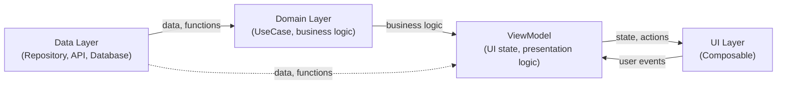
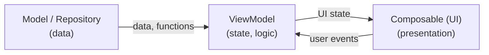

# App Architecture

## Why is App Architecture Important?

A well-designed app architecture is key to the success of any larger project. In the context of Jetpack Compose and modern Android apps, good architecture ensures:

- **Easier code maintenance**  
  Clear separation of responsibilities makes code readable and easy to understand, even after a long time or by new team members.

- **Scalability**  
  An app with thoughtful architecture can be expanded with new features without risking errors in existing parts.

- **Testability**  
  Separating business logic from UI enables easy unit and integration testing, increasing app reliability.

- **Avoiding duplication and errors**  
  Centralizing logic (e.g., in ViewModel or repository) helps avoid code duplication and accidental inconsistencies.

- **Better team collaboration**  
  Clear layer separation (UI, ViewModel, repository) allows multiple people to work in parallel without conflicts.

- **Easier migration and refactoring**  
  When new technologies or data sources appear, well-designed architecture allows easy replacement of layers without rewriting the whole app.

Good architecture is an investment that pays off throughout the app's lifecycle—from prototype, through development, to maintenance and new features.

---

## Key Principles for Designing App Architecture

When designing modern app architecture (especially in Compose), follow these principles:

- **Single Source of Truth (SSOT)**  
  Each piece of app state should have a single, central source of truth (e.g., ViewModel or repository). This avoids inconsistencies and hard-to-find bugs.

- **Unidirectional Data Flow (UDF)**  
  Data flows in one direction: from the source (Model/Repository) through ViewModel to UI. User events go back to the ViewModel, which updates the state. This simplifies debugging and testing.

- **Separation of Concerns (SoC)**  
  Each layer has a clear responsibility: UI displays data, ViewModel manages logic and state, repository provides data.

- **Immutability**  
  State passed to composables should be immutable (e.g., `val`). State changes should be handled by the ViewModel, not directly in the UI.

- **Testability**  
  Business logic should be easy to test—avoid putting it in composables, keep it in ViewModel or repository.

Applying these principles helps build apps that are readable, maintainable, and robust.

---

## Recommended Architecture for Jetpack Compose Apps

When building apps with Jetpack Compose, use a modern architecture approach for clarity, testability, and separation of concerns.

### Layered Structure

In practice, app architecture is divided into several layers:



- **UI Layer (Presentation)**  
  Contains composables responsible for displaying data and handling user interactions. UI should not contain business logic or direct data access.  
  **ViewModel is part of the UI layer as a state holder**—it manages screen state and exposes it to composables, but should not contain data access or business logic (these belong in repositories and the domain layer).

- **Data Layer**  
  Responsible for data access—local (database, files) and remote (API, network). Usually implemented via repositories.

- **(Optional) Domain Layer**  
  In larger projects, you can add a domain layer containing business logic independent of data sources and UI. This further separates responsibilities and makes testing easier.

## Main Elements of Compose Architecture

### 1. **View (UI) – Composable**
- Responsible for displaying data and handling user interactions.
- Does not contain business logic or data access.
- Receives data as parameters (e.g., UI state) and calls actions provided by the ViewModel.

### 2. **ViewModel**
- Stores and manages UI state.
- Exposes data to composables via `State` or `StateFlow`.
- Handles business logic, responds to user actions.
- Communicates with repositories and the data layer.
- Handles configuration changes (e.g., screen rotation).

> **Info**: More about ViewModel in the next section

### 3. **Repository**
- Abstraction over data sources (e.g., network, database, files).
- Allows easy swapping of implementations (e.g., for tests).
- ViewModel uses the repository, not direct data sources.

### 4. **Model**
- Data classes (e.g., `data class`) representing app data.

---

## Data Flow (Unidirectional Data Flow, UDF)

**Unidirectional Data Flow (UDF)** is a key principle of modern app architecture, especially in Jetpack Compose. It means data always flows in one direction, simplifying state management and debugging.



- Data flows from Model/Repository to ViewModel, then to UI.
- User events go from UI to ViewModel, which updates the state.

### How UDF Works in Compose

1. **Data Source (Model/Repository)**  
   Stores and provides data (e.g., from network, database).

2. **ViewModel**  
   Gets data from the repository, processes it, and exposes UI state as `State`, `StateFlow`.

   ViewModel reacts to user events, updates state, and passes it to UI.

3. **Composable (UI)**  
   Receives state as a parameter and displays it.  
   Does not modify state directly—instead, it calls functions/actions provided by the ViewModel (e.g., via lambdas).

4. **User Events**  
   User actions (e.g., clicks, text input) are passed to the ViewModel, which updates the state.  
   The updated state is sent back to the UI.

### Advantages of UDF

- **Predictability** – you always know where data comes from and where it's modified.
- **Easier debugging** – state changes are controlled and easy to trace.
- **Better testability** – business logic is separated from UI.
- **Fewer bugs from unexpected state changes**.

---

## ViewModel and State Storage (StateFlow, MutableStateFlow)

**ViewModel** is an Android architecture component responsible for storing and managing UI state and presentation logic. Its main advantage is surviving configuration changes (e.g., screen rotation), so you don't lose screen state.

### Storing State in ViewModel

In modern Compose apps, it's recommended to store state using **StateFlow** and **MutableStateFlow** from Kotlin Coroutines.

- **MutableStateFlow** – used for internal state management in ViewModel (you can change its value).
- **StateFlow** – read-only, exposed to UI (Composable).
- **Using MutableStateFlow (for modification) and StateFlow (for reading) is called state encapsulation**—only ViewModel can change the state, and UI has read-only access. This prevents accidental state changes from UI and gives full control over data flow.

#### Simple Example

```kotlin
class MyViewModel : ViewModel() {
    // Internal, mutable state
    private val _uiState = MutableStateFlow("Initial state")
    // Public, read-only
    val uiState: StateFlow<String> = _uiState

    fun updateState(newValue: String) {
        _uiState.value = newValue
    }
}
```

```kotlin
@Composable
fun MyScreen(viewModel: MyViewModel = viewModel()) {
    val uiState by viewModel.uiState.collectAsState()

    Column {
        Text(text = uiState)
        Button(onClick = { viewModel.updateState("New state") }) {
            Text("Change state")
        }
    }
}
```
#### Storing State in ViewModel Using Sealed Interface/Class

For more complex screens, it's recommended to store screen state as a sealed class or interface. This clearly describes possible UI states (e.g., loading, success, error) and makes managing them in composables easier.

**Example:**

```kotlin
// Screen state definition
sealed interface UiState {
    object Loading : UiState
    data class Success(val data: String) : UiState
    data class Error(val message: String) : UiState
}

// ViewModel with state encapsulation
class MyViewModel : ViewModel() {
    private val _uiState = MutableStateFlow<UiState>(UiState.Loading)
    val uiState: StateFlow<UiState> = _uiState

    fun loadData() {
        viewModelScope.launch {
            try {
                _uiState.value = UiState.Loading
                val result = fetchDataFromNetwork() // e.g., suspend fun
                _uiState.value = UiState.Success(result)
            } catch (e: Exception) {
                _uiState.value = UiState.Error("An error occurred")
            }
        }
    }
}
```

**In Composable:**

```kotlin
@Composable
fun MyScreen(viewModel: MyViewModel = viewModel()) {
    val uiState by viewModel.uiState.collectAsState()

    when (uiState) {
        is UiState.Loading -> CircularProgressIndicator()
        is UiState.Success -> Text((uiState as UiState.Success).data)
        is UiState.Error -> Text((uiState as UiState.Error).message, color = Color.Red)
    }
}
```

This approach makes it easy to handle different UI scenarios and maintain full control over state flow.

---
## Recommendations and Best Practices

- **Keep UI state in ViewModel**  
  Store all screen state in ViewModel using `StateFlow`, `MutableStateFlow`, or `mutableStateOf`. This makes state resilient to configuration changes and easy to test.

- **Keep composables as simple as possible**  
  Composables should only display data and pass actions to ViewModel. Avoid business logic and state management in composables.

- **Avoid business logic in composables**  
  All business logic should be in ViewModel or (in larger projects) in the domain layer (use case). UI should be only the presentation layer.

- **Use state encapsulation**  
  Expose only read-only state (`StateFlow`, `State`) to UI, and perform modifications only in ViewModel. This protects against accidental state changes from UI.

- **Use Unidirectional Data Flow (UDF)**  
  Data should flow one way: from ViewModel to UI, and user events go back to ViewModel.

## More Information

- [Official Compose Architecture Documentation](https://developer.android.com/jetpack/compose/architecture)
- [Modern Android Architecture – Guide](https://developer.android.com/topic/architecture)
- [Sample Compose Project: Now in Android](https://github.com/android/nowinandroid)

---
### 🧭 **Next topic:** [Background Work: Coroutines](https://github.com/MarcinRod/AndroidLecture2025EN/blob/main/10%20Background%20w%20Work%20-%20Coroutines.md)
